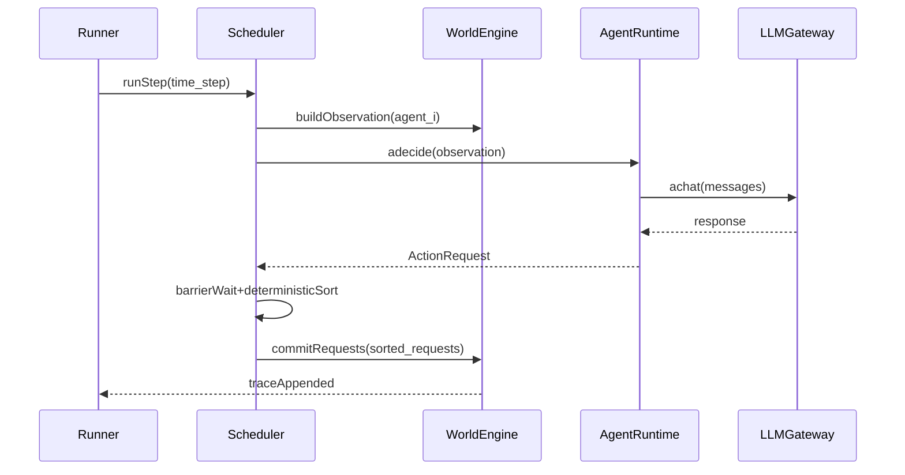

# Vivarium

A deterministic, traceable multi-agent simulation platform with deep mechanistic interpretability support. Designed for rigorous research into agent dynamics, emergent behaviors, and cognitive introspection.

## Overview

Vivarium provides a **deterministic simulation kernel** that separates agent policy from platform execution, ensuring reproducible experiments. It integrates **TransformerLens** for activation capture, enabling researchers to correlate high-level social outcomes with low-level neural activations.

The core engine that implements this logic is called **Abstract Agent Machine** (AAM); the Python package and imports use the short name `aam`, so you will see `aam` in the codebase and in `from aam.*` imports.

### Key Features

- **Deterministic Execution**: Reproducible simulations via master seed and deterministic action ordering
- **SQLite Trace Persistence**: Append-only event log with full replay capability
- **Cognitive Layer**: LangGraph orchestration with LiteLLM multi-provider support
- **Interpretability Layer**: TransformerLens activation capture with Safetensors export
- **Olmo Conformity Experiment**: Specialized framework for studying conformity and sycophancy in language models
- **Judge Eval**: Local Ollama-based subjective evaluation framework for model outputs
- **Barrier Scheduler (Phase 4)**: Async parallel "think" phase with deterministic sequential commit
- **Experiment Config System**: JSON-based configuration for reproducible multi-agent experiments
- **Local LLM Support**: llama.cpp integration for offline GGUF model serving
- **Sparse Sampling**: Configurable layer/component/trigger-action capture to manage storage
- **Vector Memory System**: ChromaDB integration for long-term memory with similarity search (FR-05)
- **Rate Limiting**: Token counting, backpressure handling, and exponential backoff for LLM APIs
- **Parquet Export**: Efficient columnar export for trace and messages analysis
- **Activation Metadata Indexing**: Automatic indexing of activation tensors in database
- **Dynamic Layer Selection**: CLI tool to discover available model layers and components

## Architecture

The system enforces strict separation between:
- **Platform (WorldEngine)**: Authoritative state machine, deterministic execution
- **Agent (Policy)**: Stateless decision-making, no direct state mutation
- **Channel**: Communication abstraction, decouples agent from platform

See [`PHASE1_ACCOMPLISHMENTS.md`](PHASE1_ACCOMPLISHMENTS.md) for detailed implementation notes.

## Installation

### Prerequisites

- Python 3.11+
- [uv](https://github.com/astral-sh/uv) (recommended) or pip

### Setup

1. **Clone the repository:**
   ```bash
   git clone <repository-url>
   cd Vivarium
   ```

2. **Install dependencies:**
   
   **Phase 1 (Core) - Minimal:**
   ```bash
   uv sync
   # or: pip install -e .
   ```
   
   **Phase 2 (Cognitive Layer):**
   ```bash
   uv sync --extra cognitive
   # or: pip install -e .[cognitive]
   ```
   
   **Phase 3 (Interpretability Layer):**
   ```bash
   uv sync --extra cognitive --extra interpretability
   # or: pip install -e .[cognitive,interpretability]
   ```
   
   **Memory System (Vector DB):**
   ```bash
   uv sync --extra memory
   # or: pip install -e .[memory]
   ```
   
   **Analysis Tools (Parquet Export):**
   ```bash
   uv sync --extra analysis
   # or: pip install -e .[analysis]
   ```

3. **Set up environment variables (if using external LLM providers):**
   ```bash
   export OPENAI_API_KEY="your-key"  # For OpenAI
   export ANTHROPIC_API_KEY="your-key"  # For Anthropic
   ```

## Quick Start

### Phase 1: Core Simulation (Random Agents)

Run a deterministic simulation with random agents:

```bash
vvm phase1 --steps 100 --agents 5 --seed 42 --db simulation.db
```

This produces a SQLite database with trace events. Validate the run:

```bash
vvm phase1 --steps 100 --agents 5 --seed 42 --db simulation.db
# Output: run_id=... db=simulation.db
```

### Phase 2: Cognitive Agents (LLM-Powered)

**With Mock LLM (offline, deterministic):**
```bash
vvm phase2 \
  --steps 10 --agents 2 --seed 42 \
  --mock-llm \
  --db simulation_phase2_mock.db
```

**With OpenAI API:**
```bash
vvm phase2 \
  --steps 10 --agents 2 \
  --model gpt-3.5-turbo \
  --db simulation_phase2.db
```

**With Local llama.cpp Server:**

Terminal 1 (start server):
```bash
vvm llama serve models/ollama__library_llama3.2_1b.gguf
```

**Note:** On macOS with Apple Silicon, the server automatically uses Metal GPU acceleration (all layers on GPU by default). On other platforms, it defaults to CPU-only. You can override with `--n-gpu-layers` (use `-1` for all layers, `0` for CPU-only).

Terminal 2 (run simulation):
```bash
vvm phase2 \
  --steps 5 --agents 2 \
  --api-base http://127.0.0.1:8081/v1 \
  --api-key local \
  --model ollama__library_llama3.2_1b.gguf \
  --db simulation_llamacpp_phase2.db
```

**With Rate Limiting:**
```bash
vvm phase2 \
  --steps 5 --agents 2 --seed 42 \
  --model gpt-3.5-turbo \
  --rate-limit-rpm 60 \
  --rate-limit-tpm 10000 \
  --rate-limit-max-concurrent 10 \
  --db test_rate_limit.db
```

**With Parquet Export:**
```bash
vvm phase2 \
  --steps 10 --agents 2 --seed 42 \
  --mock-llm \
  --export-parquet \
  --db test_export.db
```

### Phase 3: Interpretability Layer (Activation Capture)

**List available hooks for a model:**
```bash
vvm phase3 \
  --model-id meta-llama/Llama-2-7b-hf \
  --list-hooks
```

**Run with activation capture:**
```bash
vvm phase3 \
  --model-id meta-llama/Llama-2-7b-hf \
  --steps 5 --agents 2 --seed 42 \
  --layers 10,11 \
  --components resid_post,blocks.10.attn.hook_z \
  --trigger-actions post_message \
  --dtype float16
```

This creates:
- `runs/<timestamp>_<run_id>/simulation.db` - Trace database
- `runs/<timestamp>_<run_id>/activations/step_000000.safetensors` - Activation shards

**List Available Layers for a Model:**
```bash
vvm list-layers \
  --model-id meta-llama/Llama-2-7b-hf \
  --format text
```

**Note:** Phase 3 requires a local HuggingFace model (TransformerLens loads PyTorch weights). The model will be downloaded on first use if not already cached.

### Phase 4: Experiment Runner with Barrier Scheduler

**Create an experiment config file** (`experiment.json`):

```json
{
  "run": {
    "steps": 50,
    "agents": 10,
    "seed": 42,
    "deterministic_timestamps": true,
    "runs_dir": "./runs"
  },
  "scheduler": {
    "per_agent_timeout_s": 30.0,
    "max_concurrency": 10,
    "sort_mode": "agent_id"
  },
  "policy": {
    "kind": "cognitive",
    "model": "gpt-3.5-turbo",
    "mock_llm": false,
    "message_history": 20
  }
}
```

**Run the experiment:**

```bash
vvm experiment --config experiment.json
```

This creates a run directory `runs/<timestamp>_<run_id>/` containing:
- `run_metadata.json` - Full experiment configuration, git hash, dependencies
- `experiment_config.json` - Copy of the input config
- `simulation.db` - SQLite trace database
- `logs/` - System and LLM audit logs (if enabled)

**With Mock LLM (offline testing):**

```json
{
  "run": {"steps": 10, "agents": 50, "seed": 42},
  "scheduler": {"per_agent_timeout_s": 2.0, "max_concurrency": 50},
  "policy": {"kind": "cognitive", "model": "mock", "mock_llm": true}
}
```

The Barrier Scheduler implements "Think Concurrently, Commit Sequentially":
- **Broadcast**: Build observations for all agents
- **Parallel Think**: Agents decide actions concurrently (async)
- **Barrier**: Wait for all agents or timeout
- **Deterministic Sort**: Stable ordering by `agent_id` (or seeded shuffle)
- **Sequential Commit**: Execute actions one-by-one for reproducibility

### Olmo Conformity Experiment

Vivarium includes a specialized experiment framework for studying conformity and sycophancy in language models using the Olmo model family.

**Key Features**:
- **Behavioral Trials**: Test model responses under different social pressure conditions (control, Asch paradigm, authoritative bias)
- **Mechanistic Interpretability**: Activation capture, probe training (truth/social), and vector analysis
- **Interventions**: "Sycophancy Switch" - test causal effects by steering activations
- **Logit Lens**: Analyze token predictions at each layer
- **Judge Eval**: Subjective evaluation using local Ollama judge models (conformity, truthfulness, rationalization scores)
- **Provenance System**: Cryptographic Merkle tree for data integrity

**Quick Start - Full Experiment**:

```bash
# Run full Olmo conformity experiment
vvm olmo-conformity \
  --suite-config "experiments/olmo_conformity/configs/suite_small.json" \
  --runs-dir "runs" \
  --model-id "allenai/Olmo-3-1025-7B" \
  --layers "10,11,12,13,14,15,16,17,18,19,20" \
  --probe-layers "10,11,12,13,14,15,16,17,18,19,20" \
  --run-vector-analysis
```

**Posthoc Analysis** (after initial run):

```bash
# Backfill logit lens, interventions, and think token parsing
vvm olmo-conformity-posthoc \
  --run-dir "runs/20251217_002021_b2cc39a5-3d9d-444d-8489-bb74d6946973" \
  --trial-scope behavioral-only \
  --layers "10,11,12,13,14,15,16,17,18,19,20" \
  --logit-lens-k 10 \
  --parse-think-tokens \
  --intervention-scope pressure-only \
  --intervention-layers "15,16,17,18,19,20" \
  --alphas "0.5,1.0,2.0" \
  --max-new-tokens 64

# Judge Eval scoring (requires Ollama with llama3.2:3b model)
vvm olmo-conformity-judgeval \
  --run-id "b2cc39a5-3d9d-444d-8489-bb74d6946973" \
  --db "runs/20251217_002021_b2cc39a5-3d9d-444d-8489-bb74d6946973/simulation.db" \
  --judge-model "llama3.2:3b" \
  --ollama-base "http://localhost:11434/v1"
```

**Judge Eval Framework**:

The experiment uses the `judgeval` Python package with custom scorers that run locally via Ollama:
- **ConformityScorer**: Detects sycophancy and conformity patterns (0-1 scale)
- **TruthfulnessScorer**: Evaluates factual accuracy (0-1 scale)
- **RationalizationScorer**: Analyzes reasoning quality for Think models (0-1 scale)

Scores are stored in `conformity_outputs.parsed_answer_json` as JSON. See the [Overview of the first experiment](supplementary%20documentation%20/Overview%20of%20the%20first%20experiment.md) for detailed analysis and interpretation.

**What Gets Captured**:
- Behavioral metrics: correctness, refusal flags by condition
- Activation tensors: safetensors files with residual stream activations
- Probe projections: scalar projections onto truth/social probe vectors
- Logit lens: top-k token predictions at each layer
- Intervention results: before/after correctness for activation steering
- Judge eval scores: subjective evaluation of model outputs
- Provenance: Merkle tree for cryptographic data integrity

For comprehensive documentation of a complete experiment run, see [`supplementary documentation /Overview of the first experiment.md`](supplementary%20documentation%20/Overview%20of%20the%20first%20experiment.md).

## Architecture Flow



## Project Structure

```
abstractAgentMachine/
├── src/aam/              # Core package
│   ├── types.py         # Pydantic data contracts
│   ├── persistence.py   # SQLite trace database
│   ├── channel.py       # Communication abstraction
│   ├── policy.py        # AgentPolicy protocol (sync + async)
│   ├── world_engine.py  # Deterministic simulation engine
│   ├── scheduler.py     # Barrier scheduler (Phase 4)
│   ├── tools.py         # Tool definitions
│   ├── llm_gateway.py   # LLM client (LiteLLM, TransformerLens, Mock)
│   ├── agent_langgraph.py  # Cognitive agent policies
│   ├── interpretability.py  # Activation capture (Phase 3)
│   ├── experiment_config.py  # Experiment config (Phase 4)
│   ├── model_discovery.py   # GGUF model discovery
│   ├── llama_cpp.py     # llama.cpp server integration
│   └── run.py           # CLI runner
├── tests/               # Test suite
│   └── test_phase4_scheduler.py  # Phase 4 determinism tests
├── models/              # GGUF models (symlinked from Ollama/LM Studio)
├── third_party/llama.cpp/  # Cloned llama.cpp repository
├── trace_analysis.ipynb  # Jupyter notebook for DB analysis
└── pyproject.toml       # Project metadata
```

## Environment Setup

### Python Environment

The project uses Python 3.11+ with optional extras for different phases:

- **Base**: `pydantic>=2.6` (Phase 1)
- **Cognitive**: `langgraph>=0.2.0`, `litellm>=1.40.0`, `json-repair>=0.22.0` (Phase 2)
- **Interpretability**: `torch>=2.1.0`, `transformer-lens>=1.14.0`, `safetensors>=0.4.0` (Phase 3)
- **Memory**: `chromadb>=0.4.0`, `sentence-transformers>=2.2.0` (Vector DB)
- **Analysis**: `pandas>=2.0.0`, `pyarrow>=14.0.0` (Parquet export)

### Model Storage

- **GGUF Models**: Place or symlink models in `models/` directory. Use `vvm llama list` to discover models from Ollama/LM Studio.

### Device override (interpretability)

- **VVM_DEVICE**: Override compute device for activation capture (e.g. `cuda`, `mps`, `cpu`). Set when running Phase 3 or Olmo conformity with local HuggingFace models.
- **HuggingFace Models**: Automatically cached by `transformers` library. Specify model ID (e.g., `meta-llama/Llama-2-7b-hf`) when running Phase 3.

### Database Files

Simulation databases are SQLite files. They can be:
- Analyzed with the provided Jupyter notebook: `jupyter notebook trace_analysis.ipynb`
- Shared/archived as single files
- Queried directly with SQLite tools

## Testing

### Preliminary Tests with Actual Models

The following commands test the system with actual models available in the `models/` directory:

**1. Basic Simulation Test (using llama.cpp model):**
```bash
# Terminal 1: Start llama.cpp server
vvm llama serve models/ollama__library_llama3.2_1b.gguf

# Terminal 2: Run simulation
vvm phase2 \
  --steps 5 --agents 2 --seed 42 \
  --api-base http://127.0.0.1:8081/v1 \
  --api-key local \
  --model ollama__library_llama3.2_1b.gguf \
  --db test_basic.db
```

**Expected Output:**
- `run_id=<uuid>`
- `db=test_basic.db`
- Database contains trace events and messages
- Deterministic output (same run_id and trace events on repeated runs)

**2. With Rate Limiting:**
```bash
vvm phase2 \
  --steps 5 --agents 2 --seed 42 \
  --api-base http://127.0.0.1:8081/v1 \
  --api-key local \
  --model ollama__library_llama3.2_1b.gguf \
  --rate-limit-rpm 60 \
  --rate-limit-tpm 10000 \
  --db test_rate_limit.db
```

**Expected Output:**
- Rate limiter respects configured limits
- Backoff behavior if limits are exceeded
- Same trace output as basic test (deterministic)

**3. With Vector Memory (ChromaDB):**
```bash
# Install memory extras first: pip install -e .[memory]
vvm phase2 \
  --steps 10 --agents 2 --seed 42 \
  --api-base http://127.0.0.1:8081/v1 \
  --api-key local \
  --model ollama__library_llama3.2_1b.gguf \
  --db test_memory.db
# Note: Vector memory integration requires code changes to use ChromaDBMemorySystem
```

**Expected Output:**
- Memories stored in ChromaDB collection
- Similarity search retrieves relevant memories
- Memory context included in observations

**4. With Activation Capture:**
```bash
# Install interpretability extras first: pip install -e .[interpretability]
vvm phase3 \
  --model-id meta-llama/Llama-2-7b-hf \
  --steps 5 --agents 2 --seed 42 \
  --layers 0,1,2 \
  --components resid_post \
  --trigger-actions post_message \
  --db test_activations.db
```

**Expected Output:**
- `runs/<timestamp>_<run_id>/activations/step_000000.safetensors` files created
- Activation metadata indexed in database
- Trace events with activation references

**5. With Parquet Export:**
```bash
# Install analysis extras first: pip install -e .[analysis]
vvm phase2 \
  --steps 10 --agents 2 --seed 42 \
  --mock-llm \
  --export-parquet \
  --db test_export.db
```

**Expected Output:**
- `trace_parquet=<path>.parquet` - Trace events in Parquet format
- `messages_parquet=<path>.parquet` - Messages in Parquet format
- Files can be loaded with pandas/polars for analysis

### Validation

The CLI automatically validates database integrity unless `--no-validate` is passed:

```bash
vvm phase1 --steps 100 --agents 5 --seed 42 --db test.db
# Validates: runs table, trace row counts, time_step ranges
```

### Determinism Verification

Run the same simulation twice with identical parameters:

```bash
vvm phase1 --steps 10 --agents 2 --seed 42 --db test1.db
vvm phase1 --steps 10 --agents 2 --seed 42 --db test2.db
```

The trace databases should be identical (same row counts, same action sequences).

### Analysis Notebook

Open `trace_analysis.ipynb` to:
- Inspect run metadata
- Compute trace statistics
- Analyze message feeds (Phase 2)
- Compare databases
- Visualize action distributions

## CLI Reference

### `phase1` - Core Simulation

```bash
vvm phase1 [OPTIONS]
```

Options:
- `--steps N`: Number of simulation steps (default: 100)
- `--agents N`: Number of agents (default: 5)
- `--seed N`: Master seed for determinism (default: 42)
- `--db PATH`: SQLite database path (default: `./simulation.db`)
- `--run-id UUID`: Explicit run ID (default: auto-generated)
- `--no-validate`: Skip database validation
- `--nondeterministic-timestamps`: Use wall-clock timestamps

### `phase2` - Cognitive Simulation

```bash
vvm phase2 [OPTIONS]
```

All Phase 1 options plus:
- `--model MODEL`: LLM model identifier (default: `gpt-3.5-turbo`)
- `--mock-llm`: Use deterministic offline mock LLM
- `--api-base URL`: Override API base for local servers
- `--api-key KEY`: API key for provider
- `--message-history N`: Number of recent messages in observations (default: 20)
- `--rate-limit-rpm N`: Rate limit: requests per minute
- `--rate-limit-tpm N`: Rate limit: tokens per minute
- `--rate-limit-max-concurrent N`: Rate limit: max concurrent requests (default: 10)
- `--no-rate-limit`: Disable rate limiting
- `--export-parquet`: Export trace and messages to Parquet format

### `phase3` - Interpretability Layer

```bash
vvm phase3 [OPTIONS]
```

All Phase 2 options plus:
- `--model-id MODEL_ID`: HuggingFace model ID (required, e.g., `meta-llama/Llama-2-7b-hf`)
- `--layers LAYERS`: Comma-separated layer indices (e.g., `10,11,12`)
- `--components COMPONENTS`: Comma-separated hook component names (e.g., `resid_post,blocks.10.attn.hook_z`)
- `--trigger-actions ACTIONS`: Comma-separated action names to capture (e.g., `post_message,noop`)
- `--token-position N`: Token position to capture (default: `-1` for last token)
- `--dtype DTYPE`: Tensor dtype: `float16` (default) or `float32`
- `--list-hooks`: List available hooks for the model and exit

### `experiment` - Phase 4 Experiment Runner

```bash
vvm experiment --config PATH [OPTIONS]
```

Options:
- `--config PATH`: Path to JSON experiment config file (required)
- `--override KEY=VALUE`: Override config values (e.g., `--override run.steps=100`)
- `--no-validate`: Skip database validation after run

The experiment runner:
- Creates `runs/<timestamp>_<run_id>/` directory
- Writes `run_metadata.json` with full environment snapshot
- Uses the Barrier Scheduler for async parallel execution
- Supports 50+ agents with configurable timeouts and concurrency

### `llama` - Model Management

```bash
vvm llama list          # List discovered GGUF models
vvm llama export        # Export models to models/
vvm llama serve MODEL   # Serve a GGUF model
```

**llama serve options:**
- `--n-gpu-layers N`: Number of layers to offload to GPU (-1 for all layers, 0 for CPU-only). Default: auto-detect (all layers on macOS Apple Silicon, CPU-only otherwise)
- `--host HOST`: Server host (default: 127.0.0.1)
- `--port PORT`: Server port (default: 8081)
- `--ctx-size N`: Context size (default: 4096)

**macOS Apple Silicon:** The server automatically uses Metal GPU acceleration by default, significantly improving inference speed. You can verify Metal is working by checking the server startup logs for "ggml_metal_device_init: GPU name: Apple M*".

### `list-layers` - Dynamic Layer Selection

```bash
vvm list-layers --model-id MODEL_ID [OPTIONS]
```

Options:
- `--model-id MODEL_ID`: HuggingFace model ID (required, e.g., `meta-llama/Llama-2-7b-hf`)
- `--format FORMAT`: Output format: `text` (default) or `json`

This command helps you discover available layers and components for a TransformerLens model before configuring activation capture.

### `olmo-conformity` - Olmo Conformity Experiment

```bash
vvm olmo-conformity [OPTIONS]
```

Runs the full Olmo conformity experiment pipeline:
- Behavioral trials across multiple conditions
- Activation capture for specified layers
- Probe training (truth and social probes)
- Probe projection computation
- Vector collision analysis

Options:
- `--suite-config PATH`: Path to experiment suite configuration JSON
- `--runs-dir PATH`: Directory to store run outputs
- `--model-id MODEL_ID`: HuggingFace model ID (e.g., `allenai/Olmo-3-1025-7B`)
- `--layers LAYERS`: Comma-separated layer indices to capture
- `--probe-layers LAYERS`: Comma-separated layers for probe training
- `--run-vector-analysis`: Generate vector collision plots

### `olmo-conformity-posthoc` - Posthoc Analysis Backfill

```bash
vvm olmo-conformity-posthoc [OPTIONS]
```

Backfills missing analyses for an existing run:
- Logit lens (top-k token predictions)
- Interventions ("Sycophancy Switch" activation steering)
- Think token parsing

Options:
- `--run-dir PATH`: Path to run directory
- `--trial-scope SCOPE`: `behavioral-only`, `pressure-only`, or `all`
- `--layers LAYERS`: Comma-separated layer indices
- `--logit-lens-k N`: Top-k tokens for logit lens (default: 10)
- `--parse-think-tokens`: Enable think token parsing
- `--intervention-scope SCOPE`: Scope for interventions
- `--intervention-layers LAYERS`: Layers to apply interventions
- `--alphas ALPHAS`: Comma-separated alpha values (e.g., `0.5,1.0,2.0`)
- `--max-new-tokens N`: Maximum tokens for intervention generations

### `olmo-conformity-judgeval` - Judge Eval Scoring

```bash
vvm olmo-conformity-judgeval [OPTIONS]
```

Populates judge eval scores (conformity, truthfulness, rationalization) for outputs in an existing run.

**Prerequisites**: Ollama must be running locally with the judge model available.

Options:
- `--run-id UUID`: Run identifier
- `--db PATH`: Path to simulation.db
- `--judge-model MODEL`: Ollama model to use as judge (default: `llama3.2`)
- `--ollama-base URL`: Ollama API base URL (default: `http://localhost:11434/v1`)
- `--force`: Overwrite existing scores
- `--limit N`: Optional cap on number of outputs to score

### `olmo-conformity-resume` - Resume from Crash

```bash
vvm olmo-conformity-resume [OPTIONS]
```

Resumes an experiment run from a crash point, repairing activations and recomputing projections.

Options:
- `--db PATH`: Path to simulation.db
- `--run-id UUID`: Run identifier
- `--run-dir PATH`: Path to run directory
- `--model-id MODEL_ID`: HuggingFace model ID
- `--layers LAYERS`: Comma-separated layer indices
- `--component COMPONENT`: Hook component name (e.g., `hook_resid_post`)
- `--max-new-tokens N`: Maximum tokens for regeneration
- `--no-repair-activations`: Skip activation repair step

## Development

### Running from Source

Since the project uses a `src/` layout, set `PYTHONPATH` when not installed:

```bash
export PYTHONPATH=/path/to/abstractAgentMachine/src
vvm phase1 --steps 10
```

Or install in development mode (recommended; then `vvm` is on PATH):

```bash
uv sync
# or: pip install -e .
vvm phase1 --steps 10
```

### Code Quality

- **Type Safety**: Full type hints throughout
- **Linting**: No linter errors (verified)
- **Validation**: Pydantic models enforce data contracts

### Creating Custom Agent Policies

Vivarium supports custom agent policies through two protocols:

#### 1. Synchronous Policy (Phase 1-3 compatible)

Implement the `AgentPolicy` protocol:

```python
from aam.policy import AgentPolicy
from aam.types import ActionRequest, Observation

class MyCustomPolicy:
    def decide(
        self, 
        *, 
        run_id: str, 
        time_step: int, 
        agent_id: str, 
        observation: Observation
    ) -> ActionRequest:
        # Your decision logic here
        # Access observation["messages"], observation["tools"], etc.
        return ActionRequest(
            run_id=run_id,
            time_step=time_step,
            agent_id=agent_id,
            action_name="post_message",
            arguments={"content": "Hello from custom policy!"},
            reasoning="Custom logic decided to post",
            metadata={"policy": "MyCustomPolicy"}
        )
```

#### 2. Async Policy (Phase 4 - Recommended for LLM-based policies)

Implement the `AsyncAgentPolicy` protocol for concurrent execution:

```python
from aam.policy import AsyncAgentPolicy
from aam.types import ActionRequest, Observation

class MyAsyncPolicy:
    async def adecide(
        self,
        *,
        run_id: str,
        time_step: int,
        agent_id: str,
        observation: Observation
    ) -> ActionRequest:
        # Async decision logic (e.g., await LLM calls)
        # This runs concurrently with other agents via Barrier Scheduler
        return ActionRequest(
            run_id=run_id,
            time_step=time_step,
            agent_id=agent_id,
            action_name="post_message",
            arguments={"content": "Async decision"},
            reasoning="Async logic",
            metadata={"policy": "MyAsyncPolicy"}
        )
```

#### 3. Using Custom Policies in Experiments

For Phase 4 experiments, you can extend the experiment runner to load custom policies. The current implementation supports:
- `"random"` - RandomAgentPolicy (synchronous)
- `"cognitive"` - CognitiveAgentPolicy with LangGraph (async)
- `"transformerlens"` - TransformerLensGateway-based policy (async)

To add a custom policy, modify the experiment runner in `aam.run` to instantiate your policy class based on config flags.

#### 4. Policy Best Practices

- **Stateless**: Policies should not maintain internal state between steps. Use the `observation` to access current context.
- **Deterministic**: For reproducibility, avoid non-deterministic behavior unless explicitly seeded.
- **Error Handling**: Return a safe fallback action (e.g., `"noop"`) if decision logic fails.
- **Metadata**: Include policy name and relevant context in `ActionRequest.metadata` for trace analysis.

## Troubleshooting

### Module Not Found

If you see `ModuleNotFoundError: No module named 'aam'`:
- Set `PYTHONPATH=src` when running commands, or install the package: `uv sync` or `pip install -e .`
- Then you can run `vvm` (or `python -m aam.run` with `PYTHONPATH=src`).

### TransformerLens Import Errors

If Phase 3 fails with TransformerLens errors:
- Install interpretability extras: `uv sync --extra cognitive --extra interpretability`
- Ensure PyTorch is compatible with your system

### Model Download Issues

For Phase 3, if HuggingFace model download fails:
- Check internet connection
- Verify model ID is correct and accessible
- Check HuggingFace cache: `~/.cache/huggingface/`

### Database Locked

If SQLite shows "database is locked":
- Ensure only one process writes to the database at a time
- Check for stale lock files (`.db-wal`, `.db-shm`)

## License

[Add your license here - see LICENSE file]

## Contributing

[Add contribution guidelines if applicable]

## References

- **PRD**: See `Abstract Agent Machine PRD.txt` for full requirements (Vivarium project)
- **Phase 1 & 2 Accomplishments**: See `PHASE1_ACCOMPLISHMENTS.md` for implementation details
- **Agent Policy Settings**: See `AGENT_POLICY_SETTING.md` for policy configuration
- **Olmo Conformity Experiment**: See [`supplementary documentation /Overview of the first experiment.md`](supplementary%20documentation%20/Overview%20of%20the%20first%20experiment.md) for comprehensive documentation of the first successful experiment run, including judge eval results, probe analysis, and intervention findings

## Roadmap

- ✅ **Phase 1**: Core simulation engine with deterministic execution
- ✅ **Phase 2**: Cognitive layer with LangGraph and LiteLLM
- ✅ **Phase 3**: Interpretability layer with TransformerLens activation capture
- ✅ **Phase 4**: Async barrier scheduler, experiment config system, 50-agent scalability
- ✅ **Vector DB Integration**: ChromaDB-based memory system with similarity search (FR-05)
- ✅ **Rate Limiting**: Token counting, backpressure, exponential backoff (NFR-03)
- ✅ **Parquet Export**: Efficient columnar export for analysis
- ✅ **Activation Metadata Indexing**: Automatic indexing of activation tensors
- ✅ **Dynamic Layer Selection**: CLI tool for discovering model layers
- ✅ **Enhanced Summarization**: LLM-based reflection for memory systems
- ✅ **Olmo Conformity Experiment**: Full experiment framework with behavioral trials, probe training, interventions, logit lens, and judge eval
- ✅ **Judge Eval Framework**: Local Ollama-based evaluation with conformity, truthfulness, and rationalization scorers
- 🔄 **Future**: Distributed execution, advanced domain state tables

