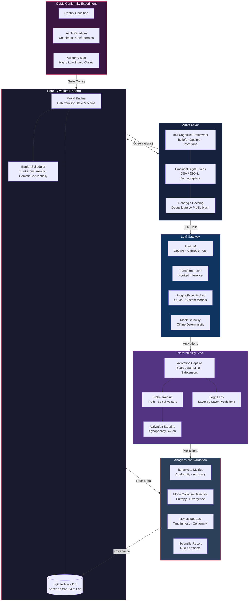
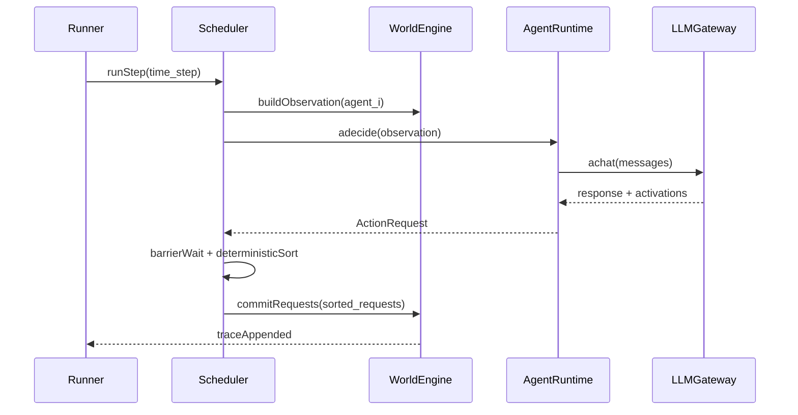

<p align="center">
  
</p>

<h1 align="center">Vivarium</h1>

<p align="center">
  <strong>A miniature world for LLM agents — playful to run, serious under the hood.</strong><br />
  <em>Reproducible multi-agent Sims meets mechanistic interpretability: same seed, same trace, optional peek inside the model.</em>
</p>

---

**Hi there.** If you have ever wanted a simulation where agents **chat, react, and collide socially** — but you still get a **SQLite movie of every step**, **deterministic replays**, and (when you use open-weight models) **activations, probes, and steering** tied to behavior — you are in the right terrarium.

### Where Vivarium fits

Open-source **agentic simulation** spans a huge design space: embodied RL environments, workflow graphs around black-box APIs, benchmarking harnesses, and more. Vivarium is optimized for **research-style multi-agent LLM experiments** where traceability and interpretability matter as much as clever prompts.

| You are trying to… | Vivarium is built to… |
|--------------------|----------------------|
| **Ship a fair A/B on agent behavior** | Keep execution **deterministic** (seeds, ordering, stable IDs) and log everything to an **append-only trace DB** |
| **Run rooms with dozens of agents** | Use a **barrier scheduler** (parallel think → ordered commit) plus **archetype caching** so duplicate personas do not nuke your API bill |
| **Ground agents in real people** | Initialize **empirical digital twins** from CSV / JSONL survey fields, with **BDI-style** prompts (beliefs · desires · intentions) |
| **Go beyond “it said X”** | Capture **sparse activations** (TransformerLens + HuggingFace hooks), train **probes**, run **logit lens**, apply **activation steering**, and wire results into reports |
| **Trust the run** | Emit **scientific run certificates**, **mode-collapse** diagnostics, and optional **Merkle-style** provenance |

**Ship shape:** the included **OLMo Conformity Experiment** is the reference stress test — behavioral trials (control, Asch-style unanimity, authority bias), mechanistic pipelines, interventions, and LLM-judge evaluation — so you can clone the pattern for your own paradigm.

## Overview

At its core, Vivarium is a **deterministic simulation kernel** that separates **agent policy** from **platform execution**. That split is what makes replays boringly reliable and what lets you swap mock, API, or hooked local models without rewriting the world.

It integrates **TransformerLens** and **HuggingFace** hooked models for activation-aligned analysis, so you can relate **population-level social outcomes** to **internal representations** when your model allows it.


```mermaid
graph TB
    subgraph Core["Core · Vivarium Platform"]
        direction TB
        WE["World Engine\nDeterministic State Machine"]
        BS["Barrier Scheduler\nThink Concurrently · Commit Sequentially"]
        DB[("SQLite Trace DB\nAppend-Only Event Log")]
        WE <--> BS
        WE --> DB
    end

    subgraph Agents["Agent Layer"]
        direction TB
        BDI["BDI Cognitive Framework\nBeliefs · Desires · Intentions"]
        DT["Empirical Digital Twins\nCSV / JSONL Demographics"]
        ARCH["Archetype Caching\nDeduplicate by Profile Hash"]
        BDI --- DT
        DT --- ARCH
    end

    subgraph LLM["LLM Gateway"]
        direction LR
        LITE["LiteLLM\nOpenAI · Anthropic · etc."]
        TL["TransformerLens\nHooked Inference"]
        HF["HuggingFace Hooked\nOLMo · Custom Models"]
        MOCK["Mock Gateway\nOffline Deterministic"]
    end

    subgraph Interp["Interpretability Stack"]
        direction TB
        ACT["Activation Capture\nSparse Sampling · Safetensors"]
        PROBE["Probe Training\nTruth · Social Vectors"]
        LOGIT["Logit Lens\nLayer-by-Layer Predictions"]
        INTERV["Activation Steering\nSycophancy Switch"]
        ACT --> PROBE
        ACT --> LOGIT
        PROBE --> INTERV
    end

    subgraph Analytics["Analytics and Validation"]
        direction LR
        BEH["Behavioral Metrics\nConformity · Accuracy"]
        VAL["Mode Collapse Detection\nEntropy · Divergence"]
        JUDGE["LLM Judge Eval\nTruthfulness · Conformity"]
        REPORT["Scientific Report\nRun Certificate"]
    end

    subgraph Experiment["OLMo Conformity Experiment"]
        direction LR
        CTRL["Control Condition"]
        ASCH["Asch Paradigm\nUnanimous Confederates"]
        AUTH["Authority Bias\nHigh / Low Status Claims"]
    end

    Agents -->|"Policy Protocol"| Core
    Core -->|"Observations"| Agents
    Agents -->|"LLM Calls"| LLM
    LLM -->|"Activations"| Interp
    Core -->|"Trace Data"| Analytics
    Interp -->|"Projections"| Analytics
    Experiment -->|"Suite Config"| Core
    Analytics -->|"Provenance"| DB

    style Core fill:#1a1a2e,stroke:#e94560,color:#fff
    style Agents fill:#16213e,stroke:#0f3460,color:#fff
    style LLM fill:#0f3460,stroke:#533483,color:#fff
    style Interp fill:#533483,stroke:#e94560,color:#fff
    style Analytics fill:#2d4059,stroke:#ea5455,color:#fff
    style Experiment fill:#3c1642,stroke:#e94560,color:#fff
```

## Key Features

| Category | Capability | Description |
|----------|-----------|-------------|
| **Core Engine** | Deterministic Execution | Reproducible simulations via master seed, stable JSON, deterministic UUIDs |
| | SQLite Trace Persistence | Append-only event log with full replay capability |
| | Barrier Scheduler | Async parallel "think" phase with deterministic sequential commit |
| | Experiment Config System | JSON-based configuration for reproducible multi-agent experiments |
| **Agent Layer** | BDI Cognitive Framework | Beliefs-Desires-Intentions prompt structure with LangGraph orchestration |
| | Empirical Digital Twins | Load real demographic profiles from CSV/JSONL for agent initialization |
| | Archetype Caching | Deduplicate agents with identical profiles to reduce LLM calls |
| | Vector Memory System | ChromaDB integration for long-term memory with similarity search |
| **LLM Integration** | Multi-Provider Gateway | LiteLLM (OpenAI, Anthropic, etc.), TransformerLens, HuggingFace hooked, Mock |
| | Local LLM Support | llama.cpp integration for offline GGUF model serving |
| | Rate Limiting | Token counting, backpressure handling, and exponential backoff |
| **Interpretability** | Activation Capture | Sparse sampling with Safetensors export and metadata indexing |
| | Probe Training | Truth and social logistic probes with layer-wise projection |
| | Logit Lens | Layer-by-layer token prediction analysis |
| | Activation Steering | Causal interventions via social vector subtraction ("Sycophancy Switch") |
| **Validation** | Mode Collapse Detection | Shannon entropy and empirical divergence metrics |
| | Scientific Report | Automated run certificates with validity flags |
| | Judge Eval | Local Ollama-based evaluation with conformity/truthfulness/rationalization scorers |
| | Merkle Provenance | Cryptographic hash chain for data integrity |

## Epics

Vivarium's capabilities are organized into six major epics:

### Epic 1 — Core Simulation Engine (Phases 1–4)

The deterministic simulation kernel with four phases of increasing capability:

- **Phase 1**: Random agents, deterministic execution, SQLite trace persistence
- **Phase 2**: Cognitive agents via LangGraph + LiteLLM multi-provider gateway
- **Phase 3**: Interpretability layer — TransformerLens activation capture with Safetensors export
- **Phase 4**: Barrier Scheduler — async parallel think, deterministic sequential commit, 50+ agent scalability

### Epic 2 — Empirical Digital Twin Initialization

Initialize agents from **real demographic survey data** rather than hand-crafted profiles:

- Load profiles from CSV, JSONL, or JSON datasets
- Deterministic assignment via stable hashing (reproducible across runs)
- Automatic persona generation injected into LLM system prompts
- Supports any demographic schema (age, gender, education, occupation, political leaning, etc.)

### Epic 3 — Scalability via LLM Archetypes

Reduce LLM cost by deduplicating agents with identical demographic profiles:

- **Canonical JSON hashing**: agents with the same profile share a single LLM call
- Scales to large populations without proportional API cost increase
- Transparent to the rest of the simulation — archetype caching is a policy-level optimization

### Epic 4 — Hybrid BDI Framing

Structure agent cognition using a **Belief-Desire-Intention** (BDI) framework:

- **[BELIEFS]**: Objective world state — time step, recent messages, environmental context
- **[DESIRES]**: Agent persona and intrinsic goals — injected from demographic profile
- **[INTENTIONS]**: Action-selection instructions with structured reasoning requirements
- Persona-aware prompting: demographic profiles shape the agent's decision context

### Epic 5 — Automated Mode Collapse & Validation Metrics

Detect when agent populations degenerate into uniform behavior:

- **Shannon entropy** of action distributions — detects if all agents choose the same action
- **Empirical divergence** — measures how synthetic output distributions deviate from expected baselines
- **Entropy time series** — track mode collapse over simulation steps
- Integrated into `ScientificReport` — automatic validity flags in run certificates

### Epic 6 — OLMo Conformity Experiment

A specialized experiment framework for studying **conformity and sycophancy** in language models:

- **Behavioral trials** across control, Asch paradigm, and authority bias conditions
- **Mechanistic interpretability**: activation capture, truth/social probe training, vector analysis
- **Activation steering**: "Sycophancy Switch" — subtract the social vector to test causal effects
- **Logit lens**: layer-by-layer token prediction analysis
- **Think token parsing**: chain-of-thought analysis for reasoning-enabled models
- **LLM judge evaluation**: condition-aware scoring for conformity, truthfulness, and rationalization
- **Suite orchestration**: batch runs across models, temperatures, datasets, and conditions

## Architecture

The system enforces strict separation between:

- **Platform (WorldEngine)**: Authoritative state machine, deterministic execution
- **Agent (Policy)**: Stateless decision-making, no direct state mutation
- **Channel**: Communication abstraction, decouples agent from platform
- **AgentStateSpace**: Mutable per-agent internal state (e.g., demographic profiles)


```mermaid
sequenceDiagram
    participant Runner
    participant Scheduler
    participant WorldEngine
    participant AgentRuntime
    participant LLMGateway

    Runner->>Scheduler: runStep(time_step)
    Scheduler->>WorldEngine: buildObservation(agent_i)
    Scheduler->>AgentRuntime: adecide(observation)
    AgentRuntime->>LLMGateway: achat(messages)
    LLMGateway-->>AgentRuntime: response + activations
    AgentRuntime-->>Scheduler: ActionRequest
    Scheduler->>Scheduler: barrierWait + deterministicSort
    Scheduler->>WorldEngine: commitRequests(sorted_requests)
    WorldEngine-->>Runner: traceAppended
```

## Installation

### Prerequisites

- Python 3.11+
- [uv](https://github.com/astral-sh/uv) (recommended) or pip

### Setup

1. **Clone the repository:**
   ```bash
   git clone <repository-url>
   cd abstractAgentMachine  # or your clone folder name
   ```

2. **Install dependencies:**

   ```bash
   # Core (Phase 1)
   uv sync

   # Cognitive Layer (Phase 2) — LangGraph + LiteLLM
   uv sync --extra cognitive

   # Interpretability (Phase 3) — TransformerLens + PyTorch
   uv sync --extra cognitive --extra interpretability

   # Vector Memory — ChromaDB
   uv sync --extra memory

   # Analysis — Parquet export
   uv sync --extra analysis
   ```

3. **Environment variables (if using external LLM providers):**
   ```bash
   export OPENAI_API_KEY="your-key"
   export ANTHROPIC_API_KEY="your-key"
   ```

## Quick Start

### Run a Deterministic Simulation

```bash
# Phase 1: Random agents
vvm phase1 --steps 100 --agents 5 --seed 42 --db simulation.db

# Phase 2: Cognitive agents with mock LLM (offline)
vvm phase2 --steps 10 --agents 2 --seed 42 --mock-llm --db sim_mock.db

# Phase 2: With a real LLM
vvm phase2 --steps 10 --agents 2 --model gpt-3.5-turbo --db sim_llm.db
```

### With Local llama.cpp Server

```bash
# Terminal 1: Start server (auto-detects Metal GPU on macOS Apple Silicon)
vvm llama serve models/ollama__library_llama3.2_1b.gguf

# Terminal 2: Run simulation
vvm phase2 \
  --steps 5 --agents 2 \
  --api-base http://127.0.0.1:8081/v1 \
  --api-key local \
  --model ollama__library_llama3.2_1b.gguf \
  --db sim_local.db
```

### Phase 3: Activation Capture

```bash
vvm phase3 \
  --model-id meta-llama/Llama-2-7b-hf \
  --steps 5 --agents 2 --seed 42 \
  --layers 10,11 \
  --components resid_post \
  --trigger-actions post_message \
  --dtype float16
```

### Phase 4: Experiment Runner

```json
{
  "run": { "steps": 50, "agents": 10, "seed": 42, "runs_dir": "./runs" },
  "scheduler": { "per_agent_timeout_s": 30.0, "max_concurrency": 10 },
  "policy": { "kind": "cognitive", "model": "gpt-3.5-turbo" }
}
```

```bash
vvm experiment --config experiment.json
```

### OLMo Conformity Experiment

```bash
# Full experiment pipeline
vvm olmo-conformity \
  --suite-config "experiments/olmo_conformity/configs/suite_small.json" \
  --runs-dir "runs" \
  --model-id "allenai/Olmo-3-1025-7B" \
  --layers "10,11,12,13,14,15,16,17,18,19,20" \
  --probe-layers "10,11,12,13,14,15,16,17,18,19,20" \
  --run-vector-analysis

# Posthoc analysis backfill
vvm olmo-conformity-posthoc \
  --run-dir "runs/<timestamp>_<run_id>" \
  --trial-scope behavioral-only \
  --layers "10,11,12,13,14,15,16,17,18,19,20" \
  --logit-lens-k 10 \
  --parse-think-tokens \
  --intervention-layers "15,16,17,18,19,20" \
  --alphas "0.5,1.0,2.0"

# LLM judge scoring (requires Ollama)
vvm olmo-conformity-judgeval \
  --run-id "<run-uuid>" \
  --db "runs/<timestamp>_<run_id>/simulation.db" \
  --judge-model "gpt-oss:20b" \
  --max-concurrency 4
```

## Project Structure

```
abstractAgentMachine/
├── src/vivarium/                        # Core package
│   ├── run.py                           # CLI entrypoint (all subcommands)
│   ├── world_engine.py                  # Deterministic simulation kernel
│   ├── scheduler.py                     # Barrier scheduler (Phase 4)
│   ├── persistence.py                   # SQLite trace database
│   ├── types.py                         # Pydantic data contracts
│   ├── policy.py                        # Agent policy protocols + Archetype caching
│   ├── agent_langgraph.py               # BDI cognitive agent (LangGraph)
│   ├── agent_state.py                   # Empirical Digital Twin initialization
│   ├── llm_gateway.py                   # Multi-backend LLM access layer
│   ├── interpretability.py              # Activation capture + Safetensors
│   ├── memory.py                        # Vector memory (ChromaDB)
│   ├── provenance.py                    # Merkle accumulator
│   ├── output_parsing.py                # Output normalization + quality flags
│   ├── channel.py                       # Communication abstraction
│   ├── domain_state.py                  # Domain-specific environment state
│   ├── experiment_config.py             # JSON experiment configuration
│   ├── model_discovery.py               # GGUF model discovery
│   ├── llama_cpp.py                     # llama.cpp server integration
│   ├── tools.py                         # Tool definitions
│   │
│   ├── analytics/                       # Analysis & visualization
│   │   ├── behavioral.py                # Conformity rates, accuracy metrics
│   │   ├── activations.py               # Activation dimensionality analysis
│   │   ├── probes.py                    # Probe visualization & tug-of-war plots
│   │   ├── interventions.py             # Intervention effect analysis
│   │   ├── think_tokens.py              # Chain-of-thought token analysis
│   │   ├── statistics.py                # McNemar, Cochran's Q, bootstrap CIs
│   │   ├── reporting.py                 # Scientific report generation
│   │   ├── validation.py                # Mode collapse & divergence detection
│   │   └── ...
│   │
│   └── experiments/olmo_conformity/     # OLMo conformity experiment
│       ├── runner.py                    # Behavioral trial suite orchestration
│       ├── cli.py                       # Experiment CLI commands
│       ├── prompts.py                   # Prompt rendering (Asch, authority, control)
│       ├── probes.py                    # Probe capture & training
│       ├── intervention.py              # Activation steering
│       ├── logit_lens.py                # Layer-by-layer analysis
│       ├── ollama_judge.py              # LLM judge evaluation
│       └── ...
│
├── experiments/olmo_conformity/         # Experiment configs & datasets
│   ├── configs/                         # Suite definitions (*.json)
│   ├── datasets/                        # Question sets (factual, opinion, math, etc.)
│   └── prompts/                         # Prompt templates
│
├── docs/                                # Documentation
├── scripts/                             # Utility & analysis scripts
├── tests/                               # Test suite
├── notebooks/                           # Jupyter analysis notebooks
├── paper/                               # Publication materials (LaTeX, figures)
└── pyproject.toml                       # Project metadata
```

## CLI Reference

| Command | Description |
|---------|-------------|
| `vvm phase1` | Core simulation with random agents |
| `vvm phase2` | Cognitive agents with LLM integration |
| `vvm phase3` | Activation capture with TransformerLens |
| `vvm experiment --config FILE` | Phase 4 experiment runner with barrier scheduler |
| `vvm olmo-conformity` | Full OLMo conformity experiment pipeline |
| `vvm olmo-conformity-posthoc` | Backfill logit lens, interventions, think tokens |
| `vvm olmo-conformity-judgeval` | LLM judge scoring (requires Ollama) |
| `vvm olmo-conformity-resume` | Resume experiment from crash |
| `vvm llama list\|export\|serve` | GGUF model management |
| `vvm list-layers` | Discover model layers for activation capture |

## Environment Setup

### Python Extras

| Extra | Dependencies | Phase |
|-------|-------------|-------|
| *base* | pydantic, numpy, pandas, matplotlib, scipy, seaborn | Phase 1 |
| `cognitive` | langgraph, litellm, json-repair | Phase 2 |
| `interpretability` | torch, transformer-lens, safetensors | Phase 3 |
| `memory` | chromadb, sentence-transformers | Vector DB |
| `analysis` | pyarrow | Parquet export |

### Device Override

Set `VVM_DEVICE` to override compute device for activation capture (`cuda`, `mps`, `cpu`).

### Database Files

Simulation databases are SQLite files. They can be analyzed with Jupyter notebooks, shared as single files, or queried directly with SQLite tools.

## Development

```bash
# Install in development mode
uv sync
# or: pip install -e .

# Run tests
python -m pytest tests/

# Verify epics
bash scripts/verify_epic2.sh
bash scripts/verify_epic3.sh
bash scripts/verify_epic4.sh
bash scripts/verify_epic5.sh
```

### Creating Custom Agent Policies

Implement `AgentPolicy` (sync) or `AsyncAgentPolicy` (async) protocols:

```python
from vivarium.policy import AsyncAgentPolicy
from vivarium.types import ActionRequest, Observation

class MyPolicy:
    async def adecide(
        self, *, run_id: str, time_step: int, agent_id: str, observation: Observation
    ) -> ActionRequest:
        return ActionRequest(
            run_id=run_id, time_step=time_step, agent_id=agent_id,
            action_name="post_message",
            arguments={"content": "Hello from custom policy!"},
            reasoning="Custom logic", metadata={"policy": "MyPolicy"},
        )
```

## Roadmap

- ✅ **Epic 1** — Core Simulation Engine (Phases 1–4)
- ✅ **Epic 2** — Empirical Digital Twin Initialization
- ✅ **Epic 3** — Scalability via LLM Archetypes
- ✅ **Epic 4** — Hybrid BDI Cognitive Framework
- ✅ **Epic 5** — Automated Mode Collapse & Validation Metrics
- ✅ **Epic 6** — OLMo Conformity Experiment (behavioral, interpretability, interventions, judge eval)
- 🔄 **Future** — Distributed execution, advanced domain state tables, additional model families

## Documentation

| Document | Description |
|----------|-------------|
| [`docs/SETUP.md`](docs/SETUP.md) | Installation & environment setup |
| [`docs/COMPREHENSIVE_SIMULATION_GUIDE.md`](docs/COMPREHENSIVE_SIMULATION_GUIDE.md) | Full workflow walkthrough |
| [`docs/ENGINEER_HANDOFF_OLMO_CONFORMITY.md`](docs/ENGINEER_HANDOFF_OLMO_CONFORMITY.md) | Architecture deep-dive & design decisions |
| [`docs/INTERPRETABILITY_CONFORMITY_EXPERIMENT.md`](docs/INTERPRETABILITY_CONFORMITY_EXPERIMENT.md) | Protocol specification & artifact requirements |
| [`docs/PROMPT_CATALOG.md`](docs/PROMPT_CATALOG.md) | Exhaustive prompt families & templates |
| [`docs/TESTING_GUIDE.md`](docs/TESTING_GUIDE.md) | Testing procedures & validation |

## License

MIT — see [LICENSE](LICENSE) file.

## Contributing

See [CONTRIBUTING.md](CONTRIBUTING.md) for guidelines.
