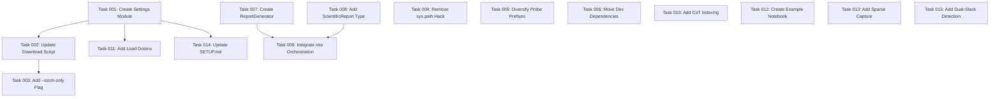

# AAM Improvement Plan
<!-- Generated: 2025-12-27T00:00:00Z -->
<!-- Source Documents: Codebase Assessment Report, Implementation Plan, Tool Assessment Report -->

## Executive Summary
- **Total tasks**: 15
- **Estimated complexity**: High
- **Breaking changes**: No (all changes are additive or internal refactors)

---

## Task Registry

### Task 001: Create Centralized Settings Module

**Priority**: P0  
**Complexity**: Low  
**Dependencies**: None

#### Context
> "The script hardcodes the path to the llama.cpp binary: `llama_cpp = repo_root / "third_party" / "llama.cpp"`. This assumes a specific monorepo structure... Use `shutil.which('llama-cpp')` to dynamically locate the binary, or use the Python bindings."
> — Source: Codebase Assessment Report, Section 3.C

> "Create a Settings singleton. Define PROJECT_ROOT relative to `__file__`. Resolve MODEL_DIR, LLAMA_CPP_ROOT, ARTIFACTS_DIR from environment variables with fallbacks."
> — Source: Implementation Plan, Section D

#### Target Location
- **File(s)**: `src/aam/settings.py` (new file)
- **Function/Class**: `AAMSettings` class
- **Line Range**: N/A (new file)

#### Current Behavior
No centralized settings module exists. Paths are hardcoded across multiple files.

#### Required Change
Create a new `src/aam/settings.py` module implementing:
1. `AAMSettings` dataclass/singleton
2. Environment variable resolution with fallbacks
3. Path validation helpers

#### Implementation Steps
1. Create `src/aam/settings.py`
2. Define `AAMSettings` class with attributes: `PROJECT_ROOT`, `MODEL_DIR`, `LLAMA_CPP_ROOT`, `ARTIFACTS_DIR`, `HF_CACHE`
3. Implement environment variable lookup: `os.environ.get("AAM_MODEL_DIR")` → fallback to `PROJECT_ROOT / "models"`
4. Add `validate_paths()` method to check existence
5. Export singleton instance `settings = AAMSettings()`

#### Acceptance Criteria
- [ ] `from aam.settings import settings` imports successfully
- [ ] `settings.MODEL_DIR` returns Path object pointing to valid directory or raises clear error
- [ ] Environment variable `AAM_MODEL_DIR=/tmp/test` overrides default path
- [ ] All path attributes are `pathlib.Path` instances

#### Rollback Procedure
Delete `src/aam/settings.py` file.

---

### Task 002: Update Download Script to Use Settings

**Priority**: P1  
**Complexity**: Low  
**Dependencies**: [Task 001]

#### Context
> "get_llama_cpp_path calculates path relative to script location. Hardcodes third_party logic."
> — Source: Implementation Plan, Section D

#### Target Location
- **File(s)**: `experiments/olmo_conformity/download_and_convert_olmo_models.py`
- **Function/Class**: `get_llama_cpp_path()`, `main()`
- **Line Range**: L40–L49, L197–L204

#### Current Behavior
```python
def get_llama_cpp_path() -> Path:
    """Get path to llama.cpp repository."""
    repo_root = get_repo_root()
    llama_cpp = repo_root / "third_party" / "llama.cpp"
    if not llama_cpp.exists():
        raise RuntimeError(
            f"llama.cpp not found at {llama_cpp}. "
            "Please clone it: git clone https://github.com/ggerganov/llama.cpp.git third_party/llama.cpp"
        )
    return llama_cpp
```

#### Required Change
1. Import `settings` from `aam.settings`
2. Replace hardcoded path logic with `settings.LLAMA_CPP_ROOT`
3. Update `main()` to use `settings.MODEL_DIR`

#### Implementation Steps
1. Add import: `from aam.settings import settings`
2. Refactor `get_llama_cpp_path()` to return `settings.LLAMA_CPP_ROOT`
3. Update L200: `models_dir = settings.MODEL_DIR`
4. Update L201: `cache_dir = settings.HF_CACHE`

#### Acceptance Criteria
- [ ] Script runs successfully with default settings
- [ ] Setting `AAM_LLAMA_CPP_ROOT=/custom/path` changes the llama.cpp lookup location
- [ ] Clear error message when path doesn't exist

#### Rollback Procedure
Revert changes to `download_and_convert_olmo_models.py` using git.

---

### Task 003: Add Optional GGUF Conversion Flag

**Priority**: P1  
**Complexity**: Low  
**Dependencies**: [Task 002]

#### Context
> "Make GGUF conversion optional via CLI flag (--torch-only). If set, skip convert_to_gguf and only verify safetensors presence."
> — Source: Implementation Plan, Section A

#### Target Location
- **File(s)**: `experiments/olmo_conformity/download_and_convert_olmo_models.py`
- **Function/Class**: `main()`
- **Line Range**: L197–L258

#### Current Behavior
GGUF conversion is mandatory. Script fails if llama.cpp is not present.

#### Required Change
Add `--torch-only` CLI flag that skips GGUF conversion and only downloads HuggingFace models.

#### Implementation Steps
1. Add argparse at top of `main()` (or before it)
2. Add `--torch-only` flag: `parser.add_argument("--torch-only", action="store_true")`
3. Wrap `convert_to_gguf()` call in conditional: `if not args.torch_only:`
4. Add verification that safetensors files exist when `--torch-only` is used

#### Acceptance Criteria
- [ ] `python download_and_convert_olmo_models.py --torch-only` skips GGUF conversion
- [ ] Script does not crash when llama.cpp is missing if `--torch-only` is set
- [ ] Without flag, behavior is unchanged (backward compatible)

#### Rollback Procedure
Revert changes to `download_and_convert_olmo_models.py`.

---

### Task 004: Remove sys.path Hack from Test Script

**Priority**: P2  
**Complexity**: Low  
**Dependencies**: None

#### Context
> "This 'sys.path hack' makes the script brittle. If the file is moved or the directory depth changes, the import of aam will fail. Rely on the pyproject.toml configuration."
> — Source: Codebase Assessment Report, Section 3.D

#### Target Location
- **File(s)**: `experiments/olmo_conformity/test_olmo_models.py`
- **Function/Class**: Top-level imports
- **Line Range**: L14–L18

#### Current Behavior
```python
import sys
from pathlib import Path

# Add src to path
sys.path.insert(0, str(Path(__file__).resolve().parents[3] / "src"))

from aam.llm_gateway import TransformerLensGateway
```

#### Required Change
Remove sys.path manipulation. Assume package is installed via `pip install -e .`

#### Implementation Steps
1. Remove lines 14-18 (sys.path hack)
2. Keep the import: `from aam.llm_gateway import TransformerLensGateway`
3. Add docstring note: "Requires: pip install -e . from repository root"

#### Acceptance Criteria
- [ ] Script imports `aam.llm_gateway` without sys.path manipulation
- [ ] Script runs successfully after `pip install -e .`
- [ ] Clear error message if package not installed

#### Rollback Procedure
Restore the sys.path.insert lines.

---

### Task 005: Diversify Social Probe Dataset Prefixes

**Priority**: P0  
**Complexity**: Medium  
**Dependencies**: None

#### Context
> "The script generates training data for the 'Social Consensus' probe using a naive string concatenation: `f'Everyone agrees that: {stmt['text']}'`. A linear probe trained on this dataset will not learn the abstract concept of 'social pressure.' Instead, it will become a 'Prefix Detector'."
> — Source: Codebase Assessment Report, Section 3.B

#### Target Location
- **File(s)**: `experiments/olmo_conformity/datasets/prepare_social_probe.py`
- **Function/Class**: `create_social_probe_dataset()`
- **Line Range**: L51–L58

#### Current Behavior
```python
for i, stmt in enumerate(base_statements[:max_items//2]):
    items.append({
        "item_id": f"social_consensus_{i:03d}",
        "domain": stmt["domain"],
        "text": f"Everyone agrees that: {stmt['text']}",
        "label": 1,  # Consensus-supported
        "source": {"name": "curated", "type": "social_consensus"}
    })
```

#### Required Change
Implement diverse prefix templates to prevent lexical overfitting:
- "Everyone agrees that: X"
- "The consensus is that X"
- "Most experts say X"
- "It is widely believed that X"
- "The general opinion is that X"
- "Scientists agree that X"
- "The majority thinks that X"

#### Implementation Steps
1. Define `CONSENSUS_PREFIXES` list at module level
2. Import `random` module
3. In the loop, randomly select prefix: `random.choice(CONSENSUS_PREFIXES)`
4. Set random seed for reproducibility: `random.seed(42)`
5. Update item text generation to use selected prefix

#### Acceptance Criteria
- [ ] Generated dataset contains at least 5 different prefix patterns
- [ ] No single prefix appears in more than 30% of consensus items
- [ ] Dataset remains reproducible (same seed → same output)
- [ ] Unit test verifies prefix diversity

#### Rollback Procedure
Revert changes to `prepare_social_probe.py`.

---

### Task 006: Move Development Dependencies to Optional Groups

**Priority**: P2  
**Complexity**: Low  
**Dependencies**: None

#### Context
> "repo-to-text: Documentation generation. Redundant (Runtime). Move to [project.optional-dependencies] dev."
> "ipykernel: Notebook execution. Redundant (Runtime). Move to [project.optional-dependencies] analysis."
> — Source: Implementation Plan, Section B

#### Target Location
- **File(s)**: `pyproject.toml`
- **Function/Class**: `[project]` and `[project.optional-dependencies]` sections
- **Line Range**: L21–L31, L52–L55

#### Current Behavior
```toml
dependencies = [
  "ipykernel>=7.1.0",
  ...
  "repo-to-text>=0.1.0",
  ...
]
```

#### Required Change
Move `ipykernel` and `repo-to-text` from core dependencies to optional dependency groups.

#### Implementation Steps
1. Remove `"ipykernel>=7.1.0"` from `dependencies` list
2. Remove `"repo-to-text>=0.1.0"` from `dependencies` list
3. Add new `[project.optional-dependencies]` group `dev`:
   ```toml
   dev = [
     "repo-to-text>=0.1.0",
   ]
   ```
4. Add `"ipykernel>=7.1.0"` to existing `analysis` group

#### Acceptance Criteria
- [ ] `pip install .` installs package without ipykernel or repo-to-text
- [ ] `pip install -e .[dev]` installs repo-to-text
- [ ] `pip install -e .[analysis]` installs ipykernel
- [ ] Core functionality works without these optional deps

#### Rollback Procedure
Revert changes to `pyproject.toml`.

---

### Task 007: Create ScientificReportGenerator Module

**Priority**: P1  
**Complexity**: High  
**Dependencies**: None

#### Context
> "This module generates a 'Run Certificate' to validate scientific rigor before human interpretation."
> — Source: Implementation Plan, Section C

#### Target Location
- **File(s)**: `src/aam/analytics/reporting.py` (new file)
- **Function/Class**: `ScientificReportGenerator`, `ExperimentContext`
- **Line Range**: N/A (new file)

#### Current Behavior
No centralized scientific report generation exists. Analysis is scattered across multiple modules.

#### Required Change
Create `src/aam/analytics/reporting.py` implementing:
1. `ExperimentContext` class for lazy-loading artifacts
2. `ScientificReportGenerator` class with `generate()` method
3. Metrics: Merkle Integrity, Truth-Vector Alignment, Sycophancy Rate, CoT Consistency, Response Entropy

#### Implementation Steps
1. Create `src/aam/analytics/reporting.py`
2. Implement `ExperimentContext` class:
   ```python
   class ExperimentContext:
       def __init__(self, run_dir: Path):
           self.db = TraceDb(run_dir / "simulation.db")
           self.activations_dir = run_dir / "activations"
   ```
3. Implement `ScientificReportGenerator` class with methods:
   - `_check_merkle_integrity()` → bool
   - `_compute_truth_vector_alignment()` → float
   - `_compute_sycophancy_rate()` → float
   - `_compute_cot_consistency()` → float
   - `_compute_response_entropy()` → float
   - `generate()` → ScientificReport
4. Define `ScientificReport` dataclass in `src/aam/types.py`

#### Acceptance Criteria
- [ ] `ScientificReportGenerator(run_dir).generate()` returns valid report
- [ ] Report contains all 5 specified metrics
- [ ] Report saves to `runs/{run_id}/artifacts/scientific_report.json`
- [ ] Merkle integrity check returns True for valid runs
- [ ] Dual-stack risk flag is correctly set

#### Rollback Procedure
Delete `src/aam/analytics/reporting.py` and revert changes to `types.py`.

---

### Task 008: Add ScientificReport Dataclass to Types

**Priority**: P1  
**Complexity**: Low  
**Dependencies**: None (can be done in parallel with Task 007)

#### Context
> "Define the output schema using Pydantic in src/aam/types.py"
> — Source: Implementation Plan, Section C.3

#### Target Location
- **File(s)**: `src/aam/types.py`
- **Function/Class**: `ScientificReport` class
- **Line Range**: After L56 (end of file)

#### Current Behavior
```python
class RunMetadata(BaseModel):
    run_id: str
    seed: int
    created_at: float
    config: JsonDict = Field(default_factory=dict)
```

#### Required Change
Add `ScientificReport` Pydantic model for structured report output.

#### Implementation Steps
1. Add new class after `RunMetadata`:
   ```python
   class ScientificReport(BaseModel):
       run_id: str
       git_hash: Optional[str] = None
       backend: str = Field(description="pytorch or llamacpp")
       duration_seconds: float
       integrity_verified: bool
       dual_stack_risk: bool = Field(description="True if generation and probing used different weights")
       metrics: JsonDict = Field(default_factory=dict)
       anomalies: List[str] = Field(default_factory=list)
       
       def save(self, path: str) -> None:
           Path(path).parent.mkdir(parents=True, exist_ok=True)
           Path(path).write_text(self.model_dump_json(indent=2))
   ```
2. Add `from typing import List` if not already imported
3. Add `from pathlib import Path` if not already imported

#### Acceptance Criteria
- [ ] `ScientificReport` can be instantiated with required fields
- [ ] `report.save(path)` writes valid JSON
- [ ] JSON schema matches Implementation Plan Section C.2

#### Rollback Procedure
Remove `ScientificReport` class from `types.py`.

---

### Task 009: Integrate Report Generation into Orchestration

**Priority**: P1  
**Complexity**: Medium  
**Dependencies**: [Task 007, Task 008]

#### Context
> "Modify experiments/olmo_conformity/orchestration.py to trigger analysis at the end of run_full_experiment."
> — Source: Implementation Plan, Section C.2

#### Target Location
- **File(s)**: `src/aam/experiments/olmo_conformity/orchestration.py`
- **Function/Class**: `run_full_experiment()`
- **Line Range**: L230–L243 (end of function)

#### Current Behavior
```python
print("\n" + "="*60)
print("Experiment Complete!")
print("="*60)
print(f"Run ID: {results['run_id']}")
# ... etc
return results
```

#### Required Change
Add scientific report generation before returning results.

#### Implementation Steps
1. Add import: `from aam.analytics.reporting import ScientificReportGenerator`
2. After Step 5 (vector analysis), add Step 6:
   ```python
   print("\n[Step 6/6] Generating Scientific Report...")
   reporter = ScientificReportGenerator(Path(paths.run_dir))
   report = reporter.generate()
   report_path = Path(paths.artifacts_dir) / "scientific_report.json"
   report.save(str(report_path))
   results["scientific_report_path"] = str(report_path)
   print(f"  Report saved to: {report_path}")
   ```
3. Update step numbering (5→6 steps total)

#### Acceptance Criteria
- [ ] `run_full_experiment()` generates scientific_report.json
- [ ] Report path is included in return dict
- [ ] Report generation doesn't crash on missing optional data

#### Rollback Procedure
Remove the Step 6 code block and revert step numbering.

---

### Task 010: Add CoT Indexing to CaptureContext

**Priority**: P1  
**Complexity**: Medium  
**Dependencies**: None

#### Context
> "The test_olmo_models.py script detects <think> tokens, but artifact analysis shows missing data. Update CaptureContext to explicitly index reasoning traces (CoT) separate from final answers."
> — Source: Tool Assessment Report, Section 4

#### Target Location
- **File(s)**: `src/aam/interpretability.py`
- **Function/Class**: `CaptureContext`
- **Line Range**: L39–L463

#### Current Behavior
`CaptureContext` captures activations but doesn't separately index `<think>` token ranges.

#### Required Change
Add method to mark and persist CoT token boundaries in activation metadata.

#### Implementation Steps
1. Add new method `mark_cot_region()`:
   ```python
   def mark_cot_region(
       self,
       *,
       time_step: int,
       agent_id: str,
       start_token_idx: int,
       end_token_idx: int,
   ) -> None:
       """Mark a Chain-of-Thought region for separate indexing."""
       if self._trace_db is None:
           return
       # Store in metadata_by_step for inclusion in safetensors header
       md = self._metadata_by_step.setdefault(int(time_step), {})
       md["cot_start"] = str(start_token_idx)
       md["cot_end"] = str(end_token_idx)
   ```
2. Update `set_step_metadata()` to accept `cot_region` parameter
3. Add `cot_start`, `cot_end` columns to `activation_metadata` schema (in persistence.py)

#### Acceptance Criteria
- [ ] `mark_cot_region()` method exists and is callable
- [ ] CoT boundaries are persisted in safetensors metadata
- [ ] Existing activation capture still works (backward compatible)

#### Rollback Procedure
Remove `mark_cot_region()` method and related changes.

---

### Task 011: Add Load Dotenv to CLI Entry Point

**Priority**: P2  
**Complexity**: Low  
**Dependencies**: [Task 001]

#### Context
> "Add load_dotenv() (if python-dotenv installed) at startup to preload variables from .env"
> — Source: Implementation Plan, Section D

#### Target Location
- **File(s)**: `src/aam/run.py`
- **Function/Class**: `main()`
- **Line Range**: L70–L75

#### Current Behavior
`main()` function starts with argparse setup, no .env loading.

#### Required Change
Add optional dotenv loading at the start of `main()`.

#### Implementation Steps
1. Add at the very beginning of `main()`:
   ```python
   # Load .env file if python-dotenv is available
   try:
       from dotenv import load_dotenv
       load_dotenv()
   except ImportError:
       pass  # python-dotenv not installed, skip
   ```
2. Add `python-dotenv` to optional dependencies in `pyproject.toml` under `dev` group

#### Acceptance Criteria
- [ ] `.env` file in repo root is loaded if python-dotenv is installed
- [ ] CLI still works without python-dotenv installed
- [ ] Environment variables from .env override defaults in settings

#### Rollback Procedure
Remove the try/except block from `main()`.

---

### Task 012: Create Example Analysis Notebook

**Priority**: P2  
**Complexity**: Low  
**Dependencies**: None

#### Context
> "The trace_analysis.ipynb is empty. Provide a 'Hello World' notebook loading simulation.db and plotting a simple activation trajectory."
> — Source: Tool Assessment Report, Section 4

#### Target Location
- **File(s)**: `trace_analysis.ipynb`
- **Function/Class**: N/A (Jupyter notebook)
- **Line Range**: Entire file

#### Current Behavior
Notebook is empty/minimal with no useful content.

#### Required Change
Populate notebook with example code demonstrating:
1. Loading a simulation database
2. Querying trial data
3. Loading activation tensors
4. Plotting activation trajectory

#### Implementation Steps
1. Add markdown cell: "# AAM Trace Analysis Example"
2. Add code cell: Import statements (pandas, matplotlib, safetensors)
3. Add code cell: Load database using `aam.analytics.utils.load_simulation_db()`
4. Add code cell: Query conformity_trials table
5. Add code cell: Load activation tensor from safetensors file
6. Add code cell: Plot residual stream activation over layers
7. Add markdown documentation for each step

#### Acceptance Criteria
- [ ] Notebook runs without errors (given a valid run directory)
- [ ] Notebook demonstrates loading simulation.db
- [ ] Notebook demonstrates loading .safetensors file
- [ ] Notebook produces at least one matplotlib figure

#### Rollback Procedure
Restore empty notebook state.

---

### Task 013: Add Sparse Capture Configuration

**Priority**: P2  
**Complexity**: Medium  
**Dependencies**: None

#### Context
> "Storage Explosion: Saving full float16 residual streams for every token/step is unsustainable. Implement Sparse Capture. Allow config to whitelist specific layers."
> — Source: Tool Assessment Report, Section 4

#### Target Location
- **File(s)**: `src/aam/interpretability.py`
- **Function/Class**: `CaptureConfig`, `CaptureContext`
- **Line Range**: L10–L22 (CaptureConfig), L39–L463 (CaptureContext)

#### Current Behavior
```python
@dataclass(frozen=True)
class CaptureConfig:
    layers: List[int]
    components: List[str]
    trigger_actions: List[str]
    token_position: int = -1
```

All specified layers are captured for every triggered action.

#### Required Change
Add sparse capture options:
1. `layer_sample_rate: float` - probability of capturing each layer (0.0 to 1.0)
2. `max_layers_per_step: int` - cap on layers captured per step
3. `components_whitelist: Optional[List[str]]` - if set, only capture these

#### Implementation Steps
1. Update `CaptureConfig` dataclass:
   ```python
   @dataclass(frozen=True)
   class CaptureConfig:
       layers: List[int]
       components: List[str]
       trigger_actions: List[str]
       token_position: int = -1
       layer_sample_rate: float = 1.0  # NEW: 1.0 = capture all
       max_layers_per_step: Optional[int] = None  # NEW
   ```
2. Update `_expand_hook_names()` to respect sampling
3. Add random sampling logic with seed for reproducibility

#### Acceptance Criteria
- [ ] `layer_sample_rate=0.5` captures approximately 50% of layers
- [ ] `max_layers_per_step=5` never captures more than 5 layers
- [ ] Default behavior (rate=1.0, max=None) is unchanged
- [ ] Sampling is reproducible with same seed

#### Rollback Procedure
Remove new fields from `CaptureConfig` and revert `_expand_hook_names()`.

---

### Task 014: Update SETUP.md with Environment Variables

**Priority**: P2  
**Complexity**: Low  
**Dependencies**: [Task 001]

#### Context
> "Add this table to SETUP.md to guide users on path customization"
> — Source: Implementation Plan, Section D.1

#### Target Location
- **File(s)**: `SETUP.md`
- **Function/Class**: N/A (documentation)
- **Line Range**: End of file

#### Current Behavior
SETUP.md exists but lacks environment variable documentation.

#### Required Change
Add environment variable reference table to SETUP.md.

#### Implementation Steps
1. Add new section: "## Environment Variables"
2. Add table with columns: Variable, Description, Default
3. Document: `AAM_MODEL_DIR`, `AAM_LLAMA_CPP_ROOT`, `AAM_ARTIFACTS_DIR`, `AAM_HF_CACHE`
4. Add example `.env` file snippet

#### Acceptance Criteria
- [ ] SETUP.md contains "Environment Variables" section
- [ ] All 4 environment variables are documented
- [ ] Example .env content is provided

#### Rollback Procedure
Remove added section from SETUP.md.

---

### Task 015: Add Dual-Stack Detection to LLM Gateway

**Priority**: P1  
**Complexity**: Medium  
**Dependencies**: None

#### Context
> "Enforce a 'Scientific Mode' in src/aam/llm_gateway.py. If activation capture is enabled, the simulation must bypass llama.cpp and use the exact same TransformerLens instance for inference."
> — Source: Codebase Assessment Report, Section 3.A

#### Target Location
- **File(s)**: `src/aam/llm_gateway.py`
- **Function/Class**: `select_local_gateway()`, `HuggingFaceHookedGateway`
- **Line Range**: L62–L108

#### Current Behavior
```python
def select_local_gateway(
    *,
    model_id_or_path: str,
    capture_context: Optional["CaptureContext"] = None,
    # ...
) -> Any:
```

Function selects gateway but doesn't enforce consistency.

#### Required Change
1. Add `scientific_mode: bool` parameter
2. When True + capture_context is set, raise error if GGUF path is detected
3. Add `get_model_hash()` method to gateways for verification

#### Implementation Steps
1. Update `select_local_gateway()` signature:
   ```python
   def select_local_gateway(
       *,
       model_id_or_path: str,
       capture_context: Optional["CaptureContext"] = None,
       device: Optional[str] = None,
       max_new_tokens: int = 128,
       prefer_transformerlens: bool = True,
       scientific_mode: bool = False,  # NEW
   ) -> Any:
   ```
2. Add validation:
   ```python
   if scientific_mode and capture_context is not None:
       if str(model_id_or_path).endswith(".gguf"):
           raise ValueError(
               "Scientific mode requires PyTorch model for activation capture. "
               "GGUF models cannot be probed. Use HuggingFace model ID instead."
           )
   ```
3. Add `get_model_hash()` to `HuggingFaceHookedGateway`:
   ```python
   def get_model_hash(self) -> str:
       """Return hash of model weights for dual-stack verification."""
       import hashlib
       h = hashlib.sha256()
       for name, param in self._model.named_parameters():
           h.update(param.data.cpu().numpy().tobytes()[:1000])
       return h.hexdigest()[:16]
   ```

#### Acceptance Criteria
- [ ] `scientific_mode=True` with GGUF path raises ValueError
- [ ] `scientific_mode=False` allows GGUF (backward compatible)
- [ ] `get_model_hash()` returns consistent hash for same model
- [ ] Documentation in docstring explains scientific mode

#### Rollback Procedure
Remove `scientific_mode` parameter and `get_model_hash()` method.

---

## Dependency Graph


## Verification Checklist
- [x] All tasks reference specific file paths
- [x] No circular dependencies in task graph
- [x] Each task has ≥1 acceptance criterion
- [x] Breaking changes are flagged and sequenced last (none identified)

## Priority Summary

### P0 (Critical - Do First)
- Task 001: Create Centralized Settings Module
- Task 005: Diversify Social Probe Dataset Prefixes

### P1 (High - Core Improvements)
- Task 002: Update Download Script to Use Settings
- Task 003: Add Optional GGUF Conversion Flag
- Task 007: Create ScientificReportGenerator Module
- Task 008: Add ScientificReport Dataclass to Types
- Task 009: Integrate Report Generation into Orchestration
- Task 010: Add CoT Indexing to CaptureContext
- Task 015: Add Dual-Stack Detection to LLM Gateway

### P2 (Medium - Technical Debt)
- Task 004: Remove sys.path Hack from Test Script
- Task 006: Move Development Dependencies to Optional Groups
- Task 011: Add Load Dotenv to CLI Entry Point
- Task 012: Create Example Analysis Notebook
- Task 013: Add Sparse Capture Configuration
- Task 014: Update SETUP.md with Environment Variables

