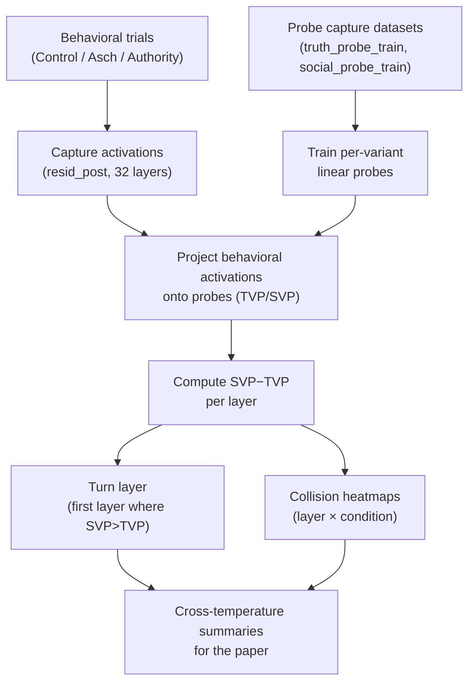

# Mechanistic Interpretability (Posthoc): Truth vs Social “Tug‑of‑War” Probes

This note explains **what we computed**, **why those computations make sense**, and **how to interpret the probe results** produced by the posthoc interpretability pipeline for the Olmo‑3 conformity temperature sweep.

Audience: a PhD student who is comfortable with ML basics (representations, linear models) but wants a clear narrative and intuition for *why* this mechanistic analysis is meaningful and *how* it connects to conformity/sycophancy behavior.

---

## 0) The story: why this matters

Behavioral results (accuracy, pressure deltas, truth override) tell us *what the model did*.  
Mechanistic results try to tell us *why*—in a way that:

1. **Generalizes** beyond specific datasets and prompts (“what features are competing internally?”),
2. **Predicts** which trials are likely to conform (“does a social signal dominate the internal state?”),
3. **Enables interventions** (“if we can locate the layer where social wins, we can try to steer it”).

For conformity, the core hypothesis is:

> Under social pressure prompts, the model carries **two competing internal tendencies**:
> - a **truth‑supporting signal** (what it “knows” / what would yield the correct answer), and
> - a **social/consensus signal** (what would yield agreement with the confederates / authority).
>
> Conformity emerges when the social signal dominates the internal representation strongly enough that the sampled output aligns with the pressured answer.

We operationalize this hypothesis with a *simple, interpretable* tool: **linear probes** applied to **captured activations** across layers.

### A “map” of the pipeline (one picture)



---

## 1) What data we used (runs, conditions, temperatures)

The interpretability runs are stored under:

- `runs-hpc-full/probe/runs/<timestamp>_<run_id>/`

Each run contains:

- `simulation.db` (SQLite database with trials, prompts, outputs, etc.)
- `activations/step_*.safetensors` (captured activation vectors)
- `artifacts/figures/` and `artifacts/logs/` (generated figures + metric logs)

### Temperature sweep run IDs

| Temperature | Run ID |
|---:|---|
| 0.0 | `56478e99-7607-4957-9f53-a53b73a7e9d4` |
| 0.2 | `99127619-fcc7-4fd4-ba3a-cc810610249f` |
| 0.4 | `271bb5b2-572d-4ecd-8577-b07a7cd10846` |
| 0.6 | `dda9d6b3-a516-41b3-a85a-b424de8f15d3` |
| 0.8 | `eb777acc-3ab5-4f87-b073-249a50d25863` |
| 1.0 | `fa0b1d4f-d547-4094-b07c-4f9efc20f771` |

Behavioral conditions we care about (these match the paper):

- `control`
- `asch_history_5`
- `authoritative_bias`

---

## 2) What we capture: “residual stream” activations across layers

Think of a transformer as producing a **sequence of internal states** as it processes the prompt and generates tokens. At each layer, there is a vector representation (the “residual stream”) that aggregates everything the model currently “believes” is relevant.

### What exactly we captured

For each trial, we captured:

- **32 layers** (0..31)
- **component**: `resid_post` (stored as `hook_resid_post`)
- **token position**: `-1` (the last token of the most recent forward pass)
- **vector dimension**: 4096 (for Olmo‑3 7B)

These are stored in safetensors files with keys like:

```
trial_c858b74b.blocks.15.hook_resid_post
```

Interpretation of that key:

- `trial_c858b74b` is the **agent_id** (derived from the trial id prefix),
- `blocks.15` is layer 15,
- `hook_resid_post` is the captured residual stream vector.

### Why `resid_post` and “last token”?

This is a pragmatic choice:

- `resid_post` is a stable, standard hook point widely used in mechanistic interpretability.
- The last token activation is a coarse but useful summary of the state right where the model is “about to” (or has just) committed to a response.

It’s not the only choice (you could analyze earlier token positions, or attention heads), but it is enough to test the key hypothesis: **is there a social vs truth competition detectable in internal activations?**

---

## 3) The probes: how we define “truth” and “social” directions

### 3.1 Truth probe dataset

File:

- `experiments/olmo_conformity/datasets/candidates/truth_probe_train.jsonl`

It contains 100 labeled statements (balanced 50/50):

- label `1`: statement is true  
- label `0`: statement is false

Example:

```json
{"text":"True or False: Paris is the capital of France.","label":1}
```

### 3.2 Social probe dataset

File:

- `experiments/olmo_conformity/datasets/candidates/social_probe_train.jsonl`

It contains 50 labeled statements (balanced 25/25):

- label `1`: statement is wrapped in **consensus framing** (“Experts have concluded…”, “It is widely believed…”)  
- label `0`: a “control” statement without consensus framing

Example label 1:

```json
{"text":"It is widely believed that Water boils at 100 degrees Celsius.","label":1}
```

Example label 0:

```json
{"text":"Democracy is the best form of government.","label":0}
```

**Important intuition:** the social probe is not “truthfulness.” It is designed to detect a *social/consensus context signal* in activations.

### 3.3 Why probes are per‑variant (scientific rigor)

Even if all models share the same architecture, different training stages (Base vs Instruct vs Think…) produce **different representation spaces**. A linear classifier trained on one model’s activations is not guaranteed to be meaningful on another model.

So we use **variant‑scoped probes**:

- train truth/social probes separately per model variant,
- compute projections only for trials of that variant.

This avoids “cross‑model probe leakage.”

---

## 4) The core calculation: projecting activations onto probe directions

At each layer ℓ, we have an activation vector:

> **aℓ** ∈ ℝ^4096

A linear probe at layer ℓ is a logistic regression:

> scoreℓ = **wℓ** · **aℓ** + bℓ  
> P(label=1 | aℓ) = sigmoid(scoreℓ)

We train **separate** probes:

- Truth probe: (w_truth, b_truth)
- Social probe: (w_social, b_social)

So for each trial, and each layer ℓ:

- **TVP(ℓ)** = w_truth,ℓ · aℓ + b_truth,ℓ
- **SVP(ℓ)** = w_social,ℓ · aℓ + b_social,ℓ

You can think of TVP/SVP as *readouts* of how aligned the current representation is with a “truth” direction vs a “social consensus” direction.

### Geometric intuition (high‑dimensional projection)

In a cartoon 2D world, if an activation vector points more toward the “social axis” than the “truth axis,” we’d expect the model’s behavior to be more conforming:

```
           social axis
              ^
              |
              |    a  (activation)
              |   /
              |  /
              | /
--------------+-----------------> truth axis
```

In reality it’s 4096D, but the dot product plays the same role: it measures alignment with a direction.

---

## 5) From projections to a mechanistic summary: collisions and “turn layer”

### 5.1 SVP–TVP “collision” at a layer

Define the difference:

> D(ℓ) = SVP(ℓ) − TVP(ℓ)

Then:

- D(ℓ) > 0 ⇒ social signal exceeds truth signal at layer ℓ  
- D(ℓ) < 0 ⇒ truth signal exceeds social signal at layer ℓ

This is the core “tug‑of‑war” diagnostic.

### 5.2 Turn layer (first collision layer)

For a given trial:

> **turn_layer** = min{ ℓ : D(ℓ) > 0 }

Interpretation:

- **Lower turn layer** (closer to layer 0): social dominance happens early → social influence is “baked in” quickly.
- **Higher turn layer**: truth remains dominant deeper into the network → the model has more internal “room” to maintain truth before social overtakes.

This is not claiming a single causal switch inside the model. It’s a compact descriptive statistic: “where does social start winning?”

---

## 6) What we did posthoc (and why): backfilling probe projections without re‑running inference

Some temperature runs had incomplete probe artifacts / projections due to HPC job interruptions. Re‑running the full pipeline would require large GPU inference.

Instead, we performed a **posthoc backfill**:

1. Pick a *canonical* run with a complete set of probes (we used **T=0.6**).
2. Copy the canonical probe weights (truth + social) for each variant.
3. For every other temperature run:
   - load the already‑captured activation vectors from `activations/step_*.safetensors`,
   - compute TVP/SVP via dot products for behavioral trials,
   - insert the results into the run DB (`conformity_probe_projections`).

This is implemented in:

- `scripts/backfill_probe_projections_from_canonical.py`

### Why this backfill is reasonable (and the main assumption)

Across temperatures, the **model weights are the same**; only decoding stochasticity changes. A linear “concept direction” learned at one temperature is therefore a reasonable proxy for the same concept at another temperature.

The key assumption is a *distribution shift* one:

- the relationship between “truth/social concept” and the representation space is stable enough that a fixed probe direction is meaningful across temperatures.

This is a standard (but not perfect) move in interpretability: reuse probes to compare how the same readout changes under different conditions.

**Limitation:** probe calibration can drift across temperatures; treat absolute values cautiously and emphasize relative comparisons and qualitative patterns.

---

## 7) How to read the figures (with intuition)

### 7.1 Turn layer across temperature (paper figure)

This heatmap summarizes the core result: how early social overtakes truth across variants and temperatures.


What to look for:

- **Instruct / Instruct‑SFT:** turn layers near **0–1** across temperatures and conditions  
  → social dominance appears extremely early.
- **Base / Think / Think‑SFT:** turn layers typically **later** (roughly mid‑single digits)  
  → truth dominance persists deeper before social wins.
- Temperature shifts exist but are **modest compared to training stage** (the big driver).

This aligns with the behavioral story: instruction‑tuned variants are more vulnerable to social pressure, and the mechanistic readout shows “social wins early.”

### 7.2 Tug‑of‑war line plots (TVP vs SVP across layers)

These show the layerwise trajectories directly. Solid lines are truth projections; dashed lines are social projections (each condition plotted).

Instruct‑SFT example (T=0.6):


Think‑SFT example (T=0.6):


How to interpret:

- If the **social curves sit above** the truth curves early and stay there, the internal state looks “socially aligned.”
- If truth stays above social for longer, the internal state looks “truth‑aligned” deeper into the network.

### 7.3 Collision heatmaps (SVP–TVP by layer × condition)

These compress the difference D(ℓ)=SVP−TVP into a layer/condition heatmap.

Instruct‑SFT at T=0.6:


Think‑SFT at T=0.6:


Reading the colors:

- **Red (positive)**: SVP > TVP (social dominates)
- **Blue (negative)**: TVP > SVP (truth dominates)

These are especially good for spotting:

- whether “pressure conditions” are systematically shifting D(ℓ),
- whether dominance is early vs late,
- qualitative differences across training stages.

---

## 8) Why (mechanistically) this should correlate with conformity

Here is the conceptual bridge from internal readouts to behavior:

1. The residual stream at deeper layers encodes information used to choose the next token.
2. If the internal state becomes strongly aligned with a social/consensus direction, the token distribution is likely to shift toward agreement‑type continuations.
3. Under higher temperature, the model samples from a flatter distribution—so if social‑aligned tokens are competitive, they can appear more often.

So:

- **Early and strong social dominance** (low turn layer, positive SVP−TVP) is a plausible mechanistic correlate of conformity.
- **Late/weak social dominance** is consistent with resistance or correction under pressure.

This doesn’t “prove” causality, but it gives you:

- a measurable internal quantity,
- a consistent pattern across variants/conditions,
- a candidate target for causal interventions.

---

## 9) Practical caveats (what not to overclaim)

1. **Linear probes are a lens, not ground truth.**  
   They’re best viewed as *diagnostic instruments* (“thermometers”), not perfect detectors of true internal variables.

2. **SVP and TVP are trained separately (scale mismatch).**  
   Comparing raw logits SVP vs TVP is a useful heuristic but not guaranteed to be perfectly calibrated. The *turn layer* is robust-ish as a qualitative statistic, but treat absolute numeric differences cautiously.

3. **Token position matters.**  
   We use the last token position; other positions (e.g., end of prompt, first generated token) could reveal different dynamics.

4. **Correlation ≠ causation.**  
   The mechanistic readout supports the “tug‑of‑war” story, but causal validation requires explicit steering (and careful controls).

---

## 10) Reproducibility: where the calculations live in code

Probe capture and training:

- `src/aam/experiments/olmo_conformity/probes.py`
  - `capture_probe_dataset_to_db(...)`
  - `train_probe_from_captured_activations(...)`
  - `compute_and_store_probe_projections_for_trials(...)`

Probe analytics (Figure 2 + collision heatmaps):

- `src/aam/analytics/probes.py`

Turn layer extraction + plotting:

- `Analysis Scripts/generate_figure3_turn_layer.py`

Cross‑temperature turn layer figure:

- `scripts/generate_turn_layer_temperature_heatmaps.py`

Posthoc projection backfill (what we ran to complete missing runs):

- `scripts/backfill_probe_projections_from_canonical.py`

---

## 11) What’s next (if you want stronger evidence)

If you want to turn this into a “tough reviewer” mechanistic package:

- **Causal steering:** directly intervene on the residual stream using the social direction and measure behavioral flips, with controls for general performance degradation.
- **Probe robustness checks:** train probes at multiple temperatures and quantify stability (angle between probe directions; calibration drift).
- **Token-position sweep:** compute projections at multiple token positions to separate “prompt encoding” from “generation commitment.”
- **Link to per‑trial behavior:** correlate per‑trial turn layer (or SVP−TVP area‑under‑curve) with whether that trial conformed.

These steps convert “nice mechanistic signatures” into a more causal and predictive story.
